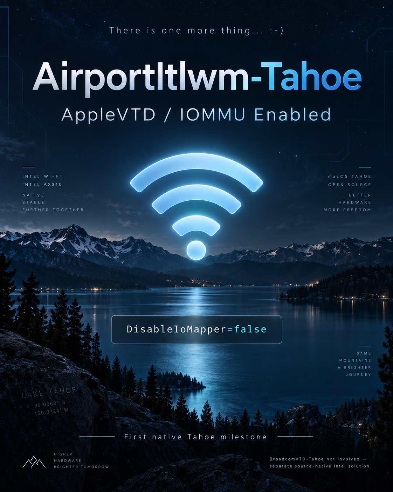

  

# AirportItlwm-Tahoe 1.0.0

**Intel Wi-Fi on macOS Tahoe with AppleVTD/system IOMapper support, active AWDL/P2P integration, bidirectional AirPlay and Screen Mirroring — physically qualified on Intel AX210.**

AirportItlwm-Tahoe is a separate Intel Wi-Fi driver based on AirportItlwm. It provides the project’s qualified OpenCore configuration with AppleVTD available, using the restored Ventura legacy wireless environment supplied by **[OCLP-CustoMac](https://github.com/kgp-macPro/OCLP-CustoMac)**. The installed bundle remains **`AirportItlwm.kext`**.

**AirportItlwm-Tahoe 1.0.0 is release-qualified.** The same frozen binary passed both release gates on Tahoe 26.6.2. No rebuild occurred between AppleVTD, conventional comparison, and additional 26.7 tests. Intel AX210 / PCI `8086:2725` is the physically qualified reference adapter; other Intel devices and platforms are not qualified merely because upstream source contains support for them.

[Installation](INSTALL.md) · [Release notes](RELEASE_NOTES_1.0.0.md) · [Qualification](docs/QUALIFICATION.md) · [Build](docs/BUILD.md) · [Source repository](https://github.com/kgp-macPro/AirportItlwm-Tahoe)

## Project and framework responsibilities

OCLP-CustoMac supplies/restores the Tahoe Modern Wireless / Apple framework environment used by KGP’s validated setup. AirportItlwm-Tahoe supplies the separate Intel driver, mapper-backed packet/command handling, reset recovery and narrow AWDL interface baseline.

AirportItlwm-Tahoe is not built into OCLP-CustoMac and does not replace required root patches. OCLP-CustoMac is not the author of the AirportItlwm AppleVTD changes. This is a Ventura legacy `IO80211FamilyLegacy` driver target, not a merger with the Sonoma V2/Skywalk implementation.

## AppleVTD and conventional configurations

The AppleVTD-capable qualification used OpenCore `Kernel → Quirks → DisableIoMapper=false`, together with captured active AppleVTD runtime state. The conventional comparison used the established mapper-disabling configuration (`DisableIoMapper=true`), referred to internally as “Normal Mode.” That is project shorthand, not an official Apple/macOS/OpenCore mode. Configuration settings are KGP-controlled test inputs; `false` alone does not prove AppleVTD is active, and `true` does not prove that all devices in the machine operate without IOMMU translation.

The mapper-aware driver path uses prepared DMA backing and generated device addresses. Its purpose is to allow the qualified Intel setup while keeping the macOS AppleVTD/system-IOMapper environment available. It does not turn an OpenCore quirk into a machine-wide IOMMU guarantee. See [configuration and verification](INSTALL.md) and [OpenCore’s quirk documentation](https://github.com/acidanthera/OpenCorePkg/blob/master/Docs/Configuration.tex).

## Physically validated configuration

| Tested environment | Result | Evidence basis |
|---|---|---|
| Tahoe 26.6.2 / 25G83, AppleVTD, `DisableIoMapper=false` | FULL PHYSICAL + RUNTIME PASS; release gate | Retained runtime captures plus KGP physical qualification |
| Tahoe 26.6.2 / 25G83, conventional comparison, `DisableIoMapper=true` | FULL PHYSICAL PASS; release gate | KGP-controlled / USER-OBSERVED qualification |
| Tahoe 26.7 / 25G229, AppleVTD | Additional scoped compatibility PASS: Wi-Fi, power cycles, reconnect, AWDL/P2P integration, AirPlay and Screen Mirroring | Retained captures plus KGP observations; **not** a second full release qualification |

Reference hardware: **Intel AX210, PCI 8086:2725**, x86_64 Custom Mac, with the restored Ventura legacy wireless ABI under Tahoe. Qualification applies to this hardware/framework/configuration combination, not every Hackintosh, Intel adapter, or upstream target. The [qualification record](docs/QUALIFICATION.md) separates captured facts from KGP’s physical observations.

## What was tested

- Cold boot and infrastructure authentication/association; DHCP/IPv4 and source/interface-bound traffic.
- Repeated Wi-Fi OFF → ON recovery through System Settings and the menu bar.
- Forget Network → reconnect and Sleep/Wake within the qualified Tahoe 26.6.2 scope.
- Active `awdl0`; registered/matched/active `IO80211P2PInterface`; AirLink role and `wifip2pd` integration.
- Sampled real IPv6/mDNS traffic on `awdl0`, including AirPlay/RAOP/P2P service records.
- Bidirectional AirPlay and bidirectional Screen Mirroring.

**RUNTIME-PROVEN:** retained AppleVTD captures establish loaded identity, registry/interface state, the first controlled power-cycle recovery and bound traffic. **USER-OBSERVED:** the conventional comparison, additional cycles, reconnect/Sleep/Wake, bidirectional features and separately reported packet samples. This distinction does not reopen the completed release gates.

**AirPlay / Screen Mirroring:** On some Tahoe systems, availability of these Apple integration features can also depend on SMBIOS, graphics configuration and framework-level feature gating rather than the Wi-Fi driver alone. If these features do not work despite otherwise functional Wi-Fi/AWDL, see [FeatureUnlock-Tahoe](https://github.com/kgp-macPro/FeatureUnlock-Tahoe). It is a separate project, not a Wi-Fi requirement or an AirportItlwm-Tahoe dependency; feature unavailability alone does not establish a Wi-Fi/AWDL or AppleVTD failure.

## AWDL/P2P scope and future work

Active `awdl0`, Apple P2P integration and the tested features do not establish complete AWDL or Apple Continuity restoration. Reported packet samples had no kernel drops; that is a sample result, not an unrestricted packet-loss guarantee.

**Important scope note:** This kext does **not** claim to restore AirDrop, Continuity Camera, or Personal Hotspot. These features, and Intel BE200 support, remain future development gates. Broader post-1.0.0 development is planned to resume starting in October 2026; this is a development plan, not a promised completion date or feature order.

## Current KGP EFI distribution

The [current public KGP EFI distribution](https://www.insanelymac.com/forum/files/file/1076-universal-efi-for-all-recent-macos-versions-including-sequoia-and-tahoe/) remains unchanged and continues to contain/recommend the established conventional Intel AirportItlwm configuration, including `DisableIoMapper=true` guidance where applicable. AirportItlwm-Tahoe is a separate, optional installation; it is not bundled into that EFI or OCLP-CustoMac. Existing users are not required to migrate.

## Installation with OpenCore

Use the official release asset’s **`AirportItlwm.kext`** with the framework environment described in [INSTALL.md](INSTALL.md). Keep the bundle, executable and identifier unchanged; use only one AirportItlwm variant for the device. Preserve a working recovery setup. This project does not install itself, configure the bootloader, or provide a substitute for required OCLP root patches.

## Build from this source

This repository already contains the complete source; internal experimental patches are not build inputs. Acquire the pinned standalone MacKernelSDK dependency, then build **only** `AirportItlwm-Tahoe / Release / x86_64` using [BUILD.md](docs/BUILD.md). The supported `fw_gen` dependency generates firmware source during a source build.

High Sierra, Mojave, Catalina, Big Sur, Monterey, Ventura, Sonoma 14.0 and Sonoma 14.4 targets remain preserved. They are not additional 1.0.0 qualified products.

## Exact release identity

| Field | Frozen 1.0.0 release identity |
|---|---|
| Bundle / executable | `AirportItlwm.kext` / `AirportItlwm` |
| Identifier | `com.zxystd.AirportItlwm` |
| Short / bundle version | `1.0.0` / `1.0.0` |
| Target / configuration / architecture | `AirportItlwm-Tahoe` / `Release` / `x86_64` |
| LC_UUID | `7039DFF1-232B-3697-8E6E-8EE505044F28` |
| Executable SHA-256 | `1202ec9bf855e944f59cc3742a90c0cf1a0a292642dfe7ed8d091a1a9c435811` |
| Info.plist SHA-256 | `05f027cc5978593c3542942488f27537fe5fb04c48b3817d7ec5025d3bc1c288` |

The same bytes serve the AppleVTD and conventional configurations. Verify the release executable using `shasum -a 256` and `dwarfdump --uuid`; the bundle name or displayed version alone does not establish loaded identity. The release package is unsigned, matching the qualified artifact.

## CI and the official release

CI checks source/target/dependency consistency, host ownership models and a hosted Xcode build. Every uploaded artifact is labeled **CI BUILD — NOT PHYSICALLY VALIDATED**. A green CI result is not physical qualification and a CI-built kext is not a substitute for the frozen 1.0.0 release binary. The qualified release used Xcode 26.5; the separately defined hosted validation toolchain is documented in [BUILD.md](docs/BUILD.md).

## Lineage and documentation

OpenIntelWireless / itlwm → pinned Dexter source → mapper-backed RX/TX/commands and deferred queue drain → narrow NKN direct VIF attach/publication → checked PC1 power-cycle recovery → dedicated legacy Tahoe target. [Technical lineage](docs/TECHNICAL_LINEAGE.md) records exact pins and evidence boundaries.

- [Installation and runtime identity](INSTALL.md)
- [Release notes](RELEASE_NOTES_1.0.0.md)
- [Qualification and limitations of the evidence](docs/QUALIFICATION.md)
- [Build and CI](docs/BUILD.md)
- [Credits and AI assistance](CREDITS.md)
- [Preserved upstream README](docs/UPSTREAM_README.md) and [license](LICENSE)

## Credits

### [KGP / kgp-macPro](https://github.com/kgp-macPro)

Project concept and direction, Tahoe integration, Intel Wi-Fi / AppleVTD / AWDL research, system integration, experimental design, physical testing and qualification, release maintenance and documentation.

### [zxystd / OpenIntelWireless](https://github.com/OpenIntelWireless/itlwm)

Original itlwm / AirportItlwm project, Intel Wi-Fi driver foundation and upstream source architecture on which AirportItlwm-Tahoe is based. [zxystd](https://github.com/zxystd) is credited with the original driver development.

### [DexterSLamb](https://github.com/DexterSLamb)

Source baseline and continued AirportItlwm development forming the direct upstream foundation used for the AirportItlwm-Tahoe implementation.

### [NorthKoreanNoodles / maddog860](https://github.com/maddog860/itlwm-Working-Ventura-Airplay)

Independent technical contribution and prior implementation of the Ventura direct AWDL VIF create / attach → alias → registerService approach. This specific approach was independently investigated, validated in the AirportItlwm-Tahoe environment and adopted narrowly for the AWDL/P2P interface-publication path; it is not authorship of AirportItlwm-Tahoe as a whole.

### [Mieze](https://github.com/Mieze) / [IntelLucy](https://github.com/Mieze/IntelLucy)

Important architectural prior art for Tahoe AppleVTD, mapper-aware DMA handling and packet-lifetime management. AirportItlwm-Tahoe does not claim copied IntelLucy source or co-development.

### OpenAI ChatGPT

Research and architecture collaboration, source/evidence analysis, experimental strategy, runtime interpretation, safety review, independent source review and technical/publication documentation.

### OpenAI Codex CLI

Source implementation/integration work, local source/binary analysis, build and validation tooling, regression testing, evidence generation and release preparation under KGP direction and independent ChatGPT review.

### [OpenCore Legacy Patcher developers](https://github.com/dortania/OpenCore-Legacy-Patcher)

Modern Wireless restoration environment used to restore the Apple legacy wireless frameworks required by the validated Tahoe setup. AirportItlwm-Tahoe remains an independent Intel Wi-Fi project.

### [OCLP-CustoMac](https://github.com/kgp-macPro/OCLP-CustoMac)

Supplies the specific Tahoe Modern Wireless framework environment used for KGP’s physical qualification, but does not contain or implement the AirportItlwm-Tahoe driver changes.

AI-assisted work was performed under continuous human direction, physical testing, review and editorial control. No endorsement by OpenAI or any referenced developer/project is implied. Inherited licenses and upstream attribution remain intact. See [CREDITS.md](CREDITS.md).

## Reporting results

For discussion, test results and user reports, please use the dedicated AirportItlwm-Tahoe threads:

- [InsanelyMac – AirportItlwm-Tahoe 1.0.0 – Intel Wi-Fi with AppleVTD/IOMMU and AWDL Baseline Support on macOS Tahoe](https://www.insanelymac.com/forum/topic/363194-airportitlwm-tahoe-100-%E2%80%93-intel-wi-fi-with-applevtdiommu-and-awdl-baseline-support-on-macos-tahoe/)

- [TonyMacx86 – AirportItlwm-Tahoe 1.0.0 – Intel Wi-Fi with AppleVTD/IOMMU and AWDL Baseline Support on macOS Tahoe](https://www.tonymacx86.com/threads/airportitlwm-tahoe-1-0-0-intel-wi-fi-with-applevtd-iommu-and-awdl-baseline-support-on-macos-tahoe.333361/)

When reporting results, please include adapter/PCI identity, macOS build, exact executable SHA-256/UUID, framework environment, configured mapper setting and observed runtime mapper state. Distinguish captured evidence from physical observations and remove personal identifiers from shared captures.
